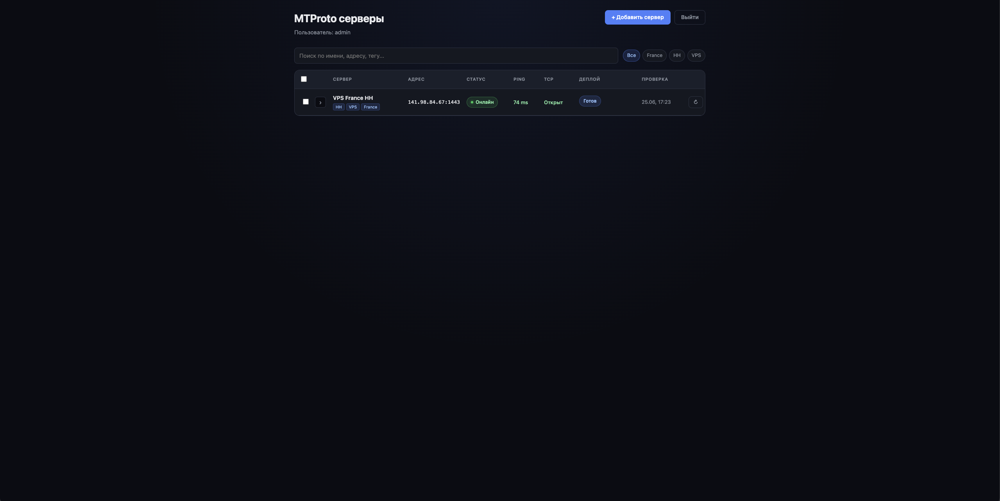
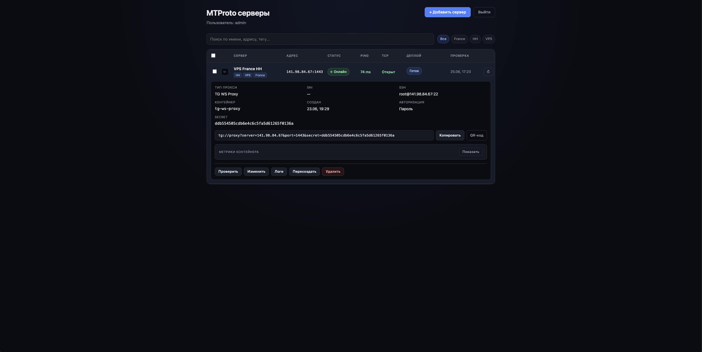
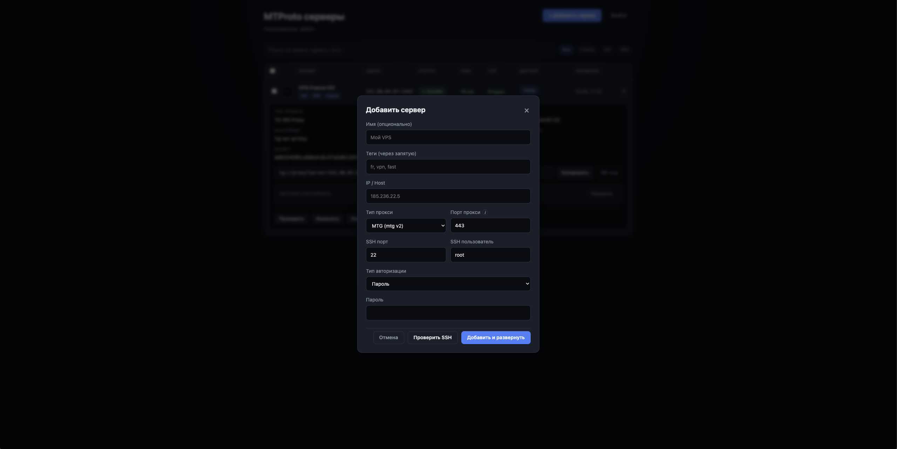
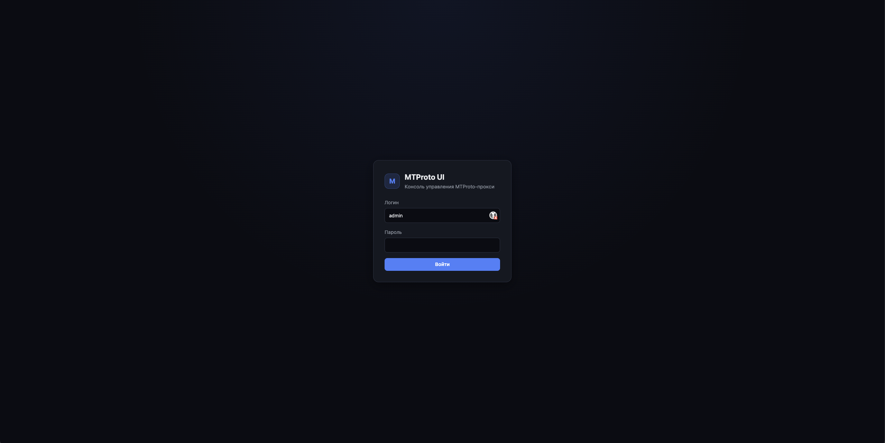
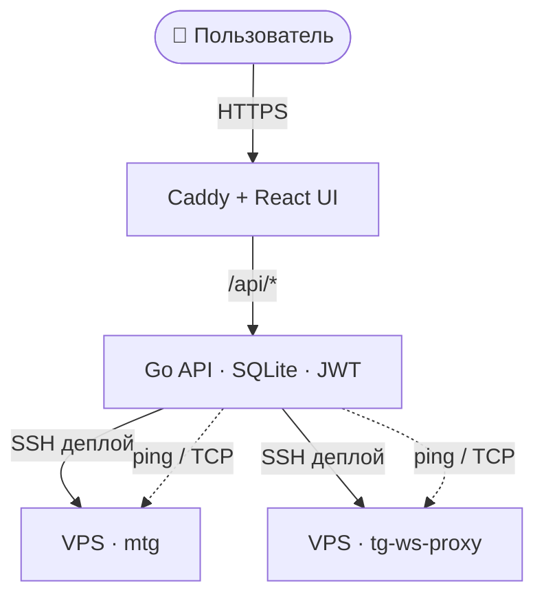

<div align="center">

# 🛰️ MTProto UI

**Веб-консоль для развёртывания и мониторинга MTProto-прокси Telegram на удалённых VPS**

Добавь сервер по SSH — система сама поставит Docker, поднимет прокси и выдаст готовую ссылку `tg://proxy?…`.

[](https://github.com/dato-dev/mtprotoui/releases)
[](LICENSE)
[](backend/go.mod)
[](frontend/package.json)
[](docker-compose.yml)



</div>

---

## ✨ Что умеет

<table>
<tr>
<td width="50%" valign="top">

**🚀 Развёртывание**
- Деплой прокси на VPS по SSH (пароль или ключ) в один клик
- Два типа прокси: **mtg v2** и **[tg-ws-proxy](https://github.com/Flowseal/tg-ws-proxy)**
- Настраиваемый порт и опциональный **Fake TLS** (ee-секрет с SNI)
- Авто-установка Docker, ретраи и таймауты — без «зависаний»
- Живой прогресс-бар деплоя и удаления

</td>
<td width="50%" valign="top">

**📊 Мониторинг и управление**
- Health-check: ICMP ping + TCP-проверка порта
- Метрики контейнера (`docker stats`): CPU, RAM, сеть, PIDs
- Просмотр логов контейнера прямо из UI
- **QR-код** proxy-ссылки для подключения с телефона
- Редактирование, теги, поиск, фильтры, сортировка, массовые операции

</td>
</tr>
</table>

**🔒 Безопасность:** SSH-credentials шифруются AES-256-GCM · JWT в httpOnly-cookie · обязательная смена слабого пароля · HTTPS через Caddy + Let's Encrypt.

---

## 🖼️ Скриншоты

<!-- Положите PNG в docs/img/ (см. docs/img/README.md) -->

| Список серверов | Детали сервера |
|:---:|:---:|
|  |  |
| **Добавление сервера** | **Вход** |
|  |  |

---

## 🧩 Типы прокси

| | **mtg v2** | **tg-ws-proxy** |
|---|---|---|
| Образ | `nineseconds/mtg:2` | `dato1/tg-ws-proxy:latest` |
| Порт по умолчанию | `443` | `1443` (рекомендуется `443`) |
| Fake TLS / SNI | всегда (ee-секрет) | опционально |
| Ссылка | `…&secret=ee…` | `…&secret=dd…` или `ee…` |
| SNI из whitelist | да | только при Fake TLS |

> SNI-домен случайно выбирается из [russia-mobile-internet-whitelist](https://github.com/hxehex/russia-mobile-internet-whitelist).

---

## 🏗️ Архитектура



| Слой | Технологии |
|------|-----------|
| Backend | Go 1.24, SQLite (pure-Go), JWT, `golang.org/x/crypto/ssh` |
| Frontend | React 18, TypeScript, Vite |
| Reverse proxy / TLS | Caddy 2 + Let's Encrypt |
| Прокси | `nineseconds/mtg:2`, `dato1/tg-ws-proxy:latest` |
| Оркестрация | Docker Compose |

---

## 🚀 Быстрый старт

**Требования:** Docker и Docker Compose. Для production с HTTPS — домен с A-записью и открытые порты 80/443.

```bash
git clone https://github.com/dato-dev/mtprotoui.git
cd mtprotoui
cp .env.example .env
```

Заполни ключевые переменные в `.env`:

```env
ENCRYPTION_KEY=<openssl rand -base64 32>
JWT_SECRET=<любая длинная случайная строка>
ADMIN_USER=admin
ADMIN_PASSWORD=<временный пароль>

# Production
DOMAIN=mtproto.example.com
ACME_EMAIL=admin@example.com

# Локально (без TLS): DOMAIN=localhost и HTTP_PORT=8080
```

Запусти:

```bash
docker compose up --build -d
```

Открой WebUI — `https://<DOMAIN>` (или `http://localhost:8080` локально). При первом входе система попросит сменить пароль на надёжный (мин. 12 символов: верхний/нижний регистр, цифра, спецсимвол).

### Добавление сервера

1. **«Добавить сервер»** → IP, SSH-доступ, тип прокси, порт, теги
2. (опционально) «Проверить SSH»
3. Подтвердить — пойдёт фоновый деплой с прогрессом

**Требования к VPS:** Linux с SSH (root или пользователь в группе `docker`), открытый порт прокси, исходящий интернет (Docker Hub, get.docker.com).

---

## 📦 Production-деплой из registry

Образы публикуются в Docker Hub (`dato1/mtprotouiapi`, `dato1/mtprotouicaddy`). Сборка/пуш с машины разработки:

```bash
docker login
docker compose -f docker-compose-prod.yml build
docker compose -f docker-compose-prod.yml push
```

На сервере (рядом нужны только `docker-compose-prod.yml` и `.env`):

```bash
docker compose -f docker-compose-prod.yml pull
docker compose -f docker-compose-prod.yml up -d
```

> Образы фиксированы на `linux/amd64`, так что сборка с Apple Silicon корректно запустится на amd64-VPS.

---

## ⚙️ Переменные окружения

### Обязательные

| Переменная | Описание |
|------------|----------|
| `ENCRYPTION_KEY` | Base64, 32 байта — шифрование SSH-credentials |
| `JWT_SECRET` | Секрет для JWT-сессий |
| `ADMIN_USER` | Логин администратора |
| `ADMIN_PASSWORD` | Начальный пароль (сменится при первом входе) |

### Caddy / HTTPS

| Переменная | По умолчанию | Описание |
|------------|--------------|----------|
| `DOMAIN` | `localhost` | Домен WebUI. Реальный домен → авто Let's Encrypt |
| `ACME_EMAIL` | — | Email для Let's Encrypt |
| `HTTP_PORT` / `HTTPS_PORT` | `80` / `443` | Порты на хосте |

### Health-check

| Переменная | По умолчанию | Описание |
|------------|--------------|----------|
| `HEALTH_INTERVAL` | `5m` | Интервал фоновых проверок |
| `PING_ENABLED` | `true` | ICMP ping (нужен `NET_RAW`) |
| `PING_COUNT` | `3` | Число ping-пакетов |
| `PING_TIMEOUT` / `TCP_TIMEOUT` | `4s` | Таймауты проверок |

### Прочие

| Переменная | По умолчанию | Описание |
|------------|--------------|----------|
| `WHITELIST_URL` | GitHub whitelist | URL списка SNI-доменов |
| `ADMIN_PASSWORD_RESET` | `false` | `true` → при старте сбросить пароль админа на `ADMIN_PASSWORD` и потребовать смену. После входа вернуть `false` |

---

## 🔌 API (кратко)

| Метод | Путь | Описание |
|-------|------|----------|
| `POST` | `/api/auth/login` | Вход |
| `POST` | `/api/auth/change-password` | Смена пароля |
| `GET` | `/api/servers` | Список серверов |
| `POST` | `/api/servers` | Добавить + деплой |
| `PATCH` | `/api/servers/:id` | Редактировать (авто-редеплой при смене порта/хоста) |
| `DELETE` | `/api/servers/:id` | Удалить (async) |
| `POST` | `/api/servers/:id/recreate` | Пересоздать прокси |
| `POST` | `/api/servers/:id/health` | Ручная проверка |
| `GET` | `/api/servers/:id/stats` | Метрики контейнера |
| `GET` | `/api/servers/:id/qr` | QR-код proxy-ссылки (PNG) |
| `GET` | `/api/servers/:id/logs` | Логи контейнера (`?tail=N`) |
| `POST` | `/api/servers/test-ssh` | Тест SSH |
| `GET` | `/api/audit` | Журнал действий (кто/когда/что) |

---

## 🛡️ Безопасность

- SSH-credentials шифруются **AES-256-GCM** (`ENCRYPTION_KEY`)
- JWT хранится в **httpOnly**-cookie
- Обязательная смена слабого начального пароля
- WebUI рекомендуется держать за **HTTPS** (Caddy + Let's Encrypt)
- **Не коммитьте `.env`** — он в `.gitignore`

> ⚠️ Известное ограничение: SSH host keys пока принимаются без проверки (`InsecureIgnoreHostKey`). TOFU — в [планах](ROADMAP.md).

---

## 🧑‍💻 Разработка

```bash
# Frontend (Vite проксирует /api → :8080)
cd frontend && npm install && npm run dev

# Backend
cd backend && go run ./cmd/api      # переменные из .env

# Сборка всего стека
docker compose up --build -d
```

### Структура проекта

```
mtprotoui/
├── backend/                # Go API
│   ├── cmd/api/
│   └── internal/{api,auth,crypto,deploy,health,operation,sshclient,store,whitelist}
│       └── deploy/scripts/ # deploy-mtproto.sh, deploy-tgws.sh
├── frontend/               # React + TypeScript (Vite)
├── caddy/                  # Caddy + сборка UI
├── docs/img/               # скриншоты для README
├── docker-compose.yml      # dev (локальная сборка)
├── docker-compose-prod.yml # prod (образы из registry)
└── ROADMAP.md
```

---

## 🗺️ Roadmap

Реализовано: типы прокси, редактирование, теги, поиск/фильтр/сортировка, массовые операции, метрики, QR, логи, сброс пароля, ретраи деплоя.

В планах: **TOFU для SSH**, метрики уровня прокси (`ss`/stats-endpoint), уведомления при падении, история uptime, многопользовательский режим, тесты бэкенда.

📋 Полный список и прогресс — в [ROADMAP.md](ROADMAP.md).

---

## 📄 Лицензия

[MIT](LICENSE) © 2026 Timur Abdullin
